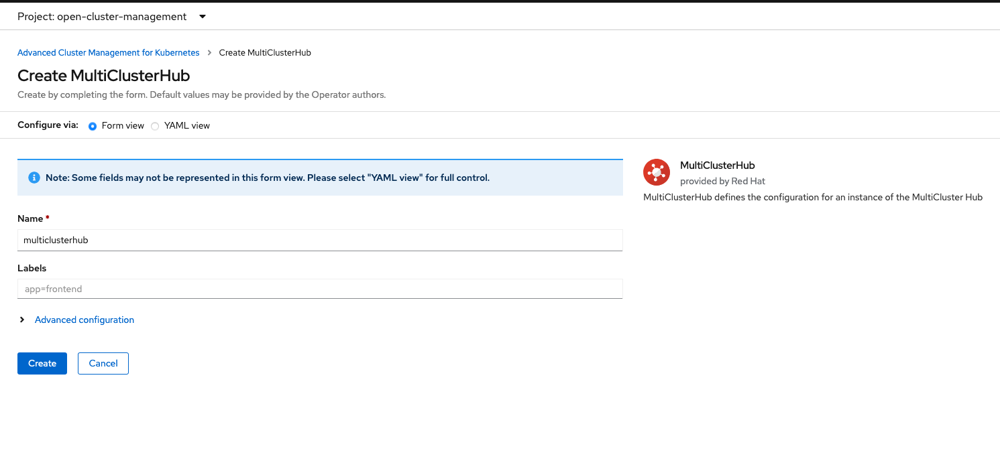
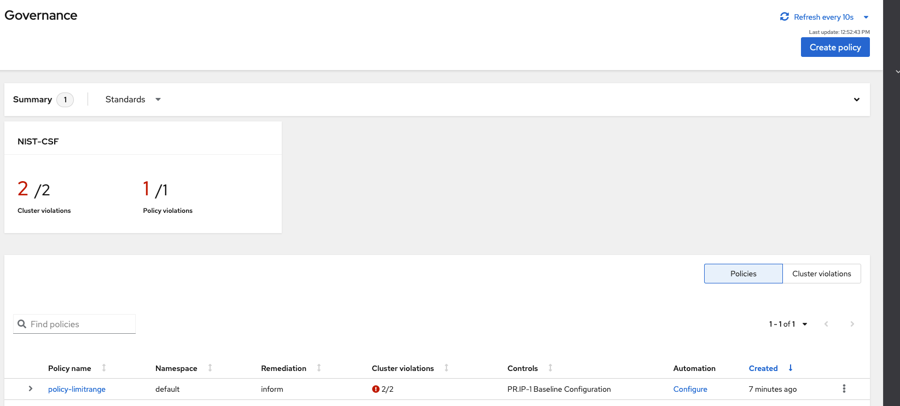

# Exercise 6: Advanced Cluster Management

Using Red Hat OpenShift Advanced Cluster Management to monitor and administrate OpenShift clusters.

# Intro

In this exercise we will create a cluster hub with 2 OpenShift clusters, we will deploy applications on them using ACM and we will finally create a policy to control their resource consumption.

# Steps 

First of all we need to install the OpenShift Advanced Cluster Management operator in the DP OpenShift cluster


And now we need to create the MultiClusterHub resource (we are asked to do that when the installation of the operator finishes)



Once it is installed (the status on `Operators -> Installed Operators -> Advanced Cluster Management for Kubernetes -> MultiClusterHub` will be Running) we will be able to log on to the ACM console. To get its URL we go to `Networking -> Routes` and we will see the URL for the `multicloud-console`, the credentials are the same as for the `SAP DP OpenShift` cluster


### Add cluster to ACM

To add the other cluster (the DP Fuse) we will use the API token and URL as import mode, so we need to retrieve this info from the login credentials of that cluster.


In the ACM console select `Clusters` and click on `Import cluster`. The cluster name will be `prod` We will also create labels for the applications that we will deploy, the backend and the frontend that we have used in Exercise 3 of this lab, the labels will be `app-be=true` and `app-fe=true`.


Once we have imported the DP Fuse cluster, we will see that also the `local-cluster` has been added and we will be able to see them along with the infrastructure they are deployed on. We will click on the `local-cluster` and edit the labels to add `app-be=true` and `app-fe=true` for it two; as mentioned before, these two labels will serve to indicate that the 2 applications that we are going to deploy later will be on both clusters.


Log on to one of your clusters, for example the DP OpenShift one. We can see that on the project list now there is a new one called `open-cluster-management`, if we select it on the `Developer` view and look at `Topology` we will see all the components that are being deployed.


The deployment of the components will take some time, we can check the Pods on `Workloads -> Pods` on `Administrator` view and once they are all marked as ready in the `Ready` column our ACM hub will be deployed.


### Deploy applications

In the ACM console we will create the 2 applications we mentioned before, one for the backend and one for the front end, by clicking on `Applications` and then on `Create application`. 

We will call the backend application `sap-backend` and the frontend one `sap-fe`. The namespace for the former is `app-be-acm` and for the latter `app-fe-acm`, The repository type will be `Git` and the URL to the repo is https://github.com/redhat-sap/sap-side-by-side-ci.git the branch will be `acm` and the path `app-be` for the backend application and `app-fe` for the frontend one.

We will also create labels to indicate the clusters where the application will be deployed. For the backend application the label will be `app-be` and for the frontened `app-fe` the value will be true for both.


Since we added these labels to our two clusters when we imported them in ACM, both the backend and the frontend applications will be deployed on both. We can see it in the tree diagram when we click on `Applications` once they have been deployed, the `Cluster` node count is 2 and it specifies the 2 clusters where the apps have been deployed, `local-cluster` and `prod`.


Now we can access the application from the ACM console, for example the frontend.


And also if we go to any of the clusters we will see the namespaces `app-fe-acm` and `app-be-acm` have been created  and we can see the application in the `Topology` view.

### Create policy for resource consumption

The specification of the policy that we are going to create is in the same GitHub repository where the frontend and backend applications are (https://github.com/redhat-sap/sap-side-by-side-ci) also in the `acm` branch, in the file `policy.yml`. We will copy the contents of the file and go to `Governance` in the ACM console and click on `Create policy`. Once there we will delete the sample code and paste the one from GitHub and the fields on the left hand side will be populated automatically.


This is what we are defining in the policy:

```bash
pods: "1" 
requests.cpu: "1" 
requests.memory: 1Gi 
requests.ephemeral-storage: 2Gi 
limits.cpu: "2" 
limits.memory: 4Gi 
limits.ephemeral-storage: 10Gi
```

So the maximum resources that can be allocated are 2 CPUs, 4GB of RAM and 10GB of disk.

Policies are defined at namespace level. At the moment we will see in `Governance` that both clusters are violting the policy.



And if we look at the cause it is because no quotas have been defined yet.


We need to enforce the policy and then the quotas will be created automatically.


Once enforced we will see that there are no policy violations anymore. If we go to any of the clusters to the namespaces of the applications we have created (`app-be-acm` or `app-fe-acm`) and go to `Administration -> Resource Quotas` we will be able to see the current resource quotas.

Now we will try to modify the resources and add more than what the policy allows, we will get an error and then we will revert back to a value permitted by the policy and we will see we are able to assign it. For this we will go for example to the DP Fuse cluster, to the `app-be-acm` project and there to `Workloads -> DeploymentConfigs` where we will be able to edit the `YAML` definition.

